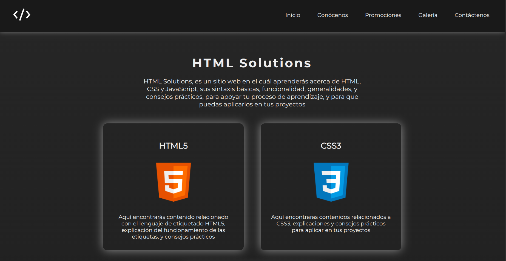
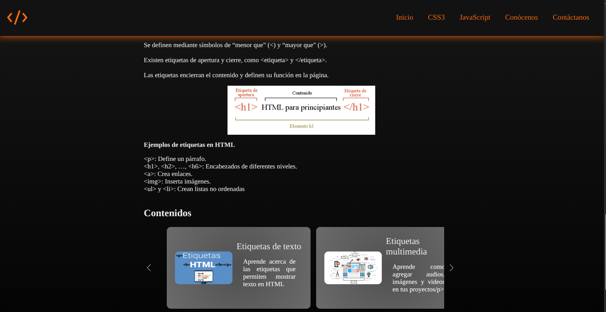
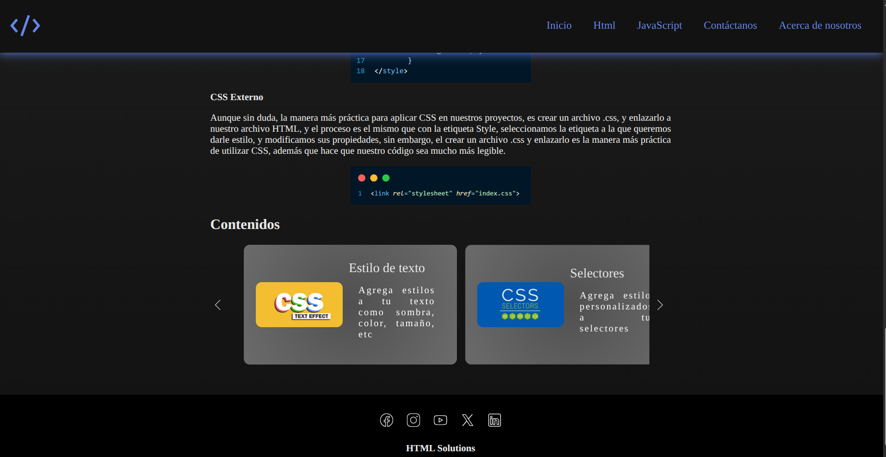
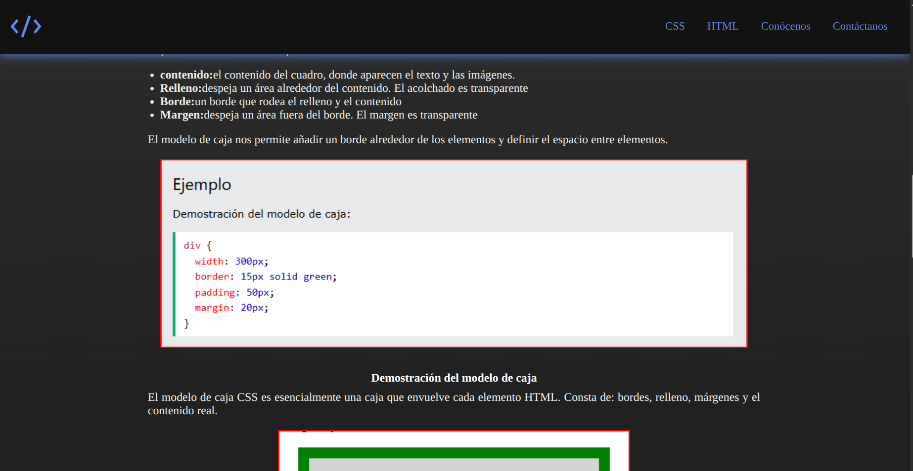
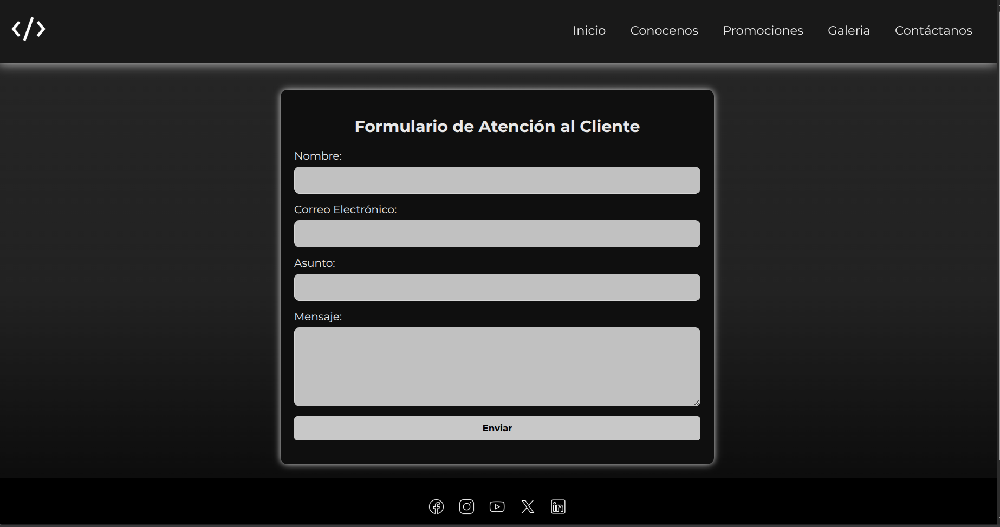
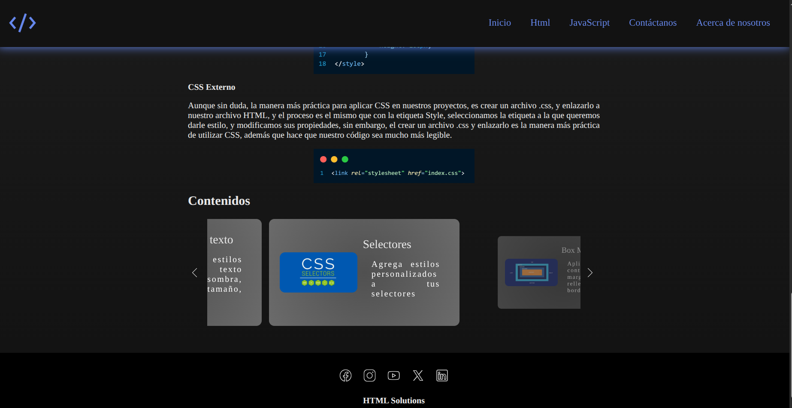

# 🌐 HTML Solutions — Práctica de HTML5 & CSS3

Mini-sitio de referencia y práctica sobre maquetado semántico con HTML5 y diseño responsive con CSS3, construido sin frameworks ni dependencias externas.


---

## 📋 Descripción

**HTML Solutions** es un mini-sitio educativo construido para practicar y consolidar conceptos de HTML5 y CSS3: etiquetas semánticas, box model, selectores, estilos de texto y atajos con Emmet. Incluye además un conjunto de páginas estilo landing (Conócenos, Contáctanos, Galería, Promociones) para practicar el maquetado típico de un sitio de negocio.

<p align="center">
  
  
  
  
  
  
  
</p>

---

## 🗂️ Mapa del sitio

```
html-solution/
├── main.html                    # Página principal / punto de entrada
├── acerca_d/                    # Páginas estilo landing
│   ├── conocenos.html
│   ├── contactanos.html
│   ├── galeria_img.html
│   └── promociones.html
├── parte_html/                  # Sección de práctica de HTML5
│   ├── html_index.html
│   └── paginas/ (contenido1, contenido2)
├── parte_css/                   # Sección de práctica de CSS3
│   ├── css_index.html
│   └── paginas/ (boxModel, emmet, select, text_Style)
└── fuentes/Poppins/             # Fuente tipográfica auto-hospedada
```

---

## ⚙️ Características técnicas

- Maquetado con **etiquetas semánticas** de HTML5 (`header`, `nav`, `main`, `section`, `footer`).
- Diseño **responsive** con **Flexbox** y **Media Queries**.
- Tipografía personalizada con la fuente **Poppins** auto-hospedada (sin depender de Google Fonts).
- Organización de estilos por página/sección en archivos CSS independientes.

---

## 🚀 Cómo verlo

No requiere instalación, servidor ni dependencias. Basta con clonar o descargar el repositorio y abrir `main.html` directamente en el navegador:

```bash
git clone https://github.com/isac-deodanes/html-solution.git
cd html-solution
```

Luego abre `main.html` con tu navegador de preferencia.

---

## 👨‍💻 Autor

**Isaac Dagoberto Deodanes Benitez**
Desarrollador Full Stack Jr
📧 isacdeodanes@gmail.com · 💻 [GitHub](https://github.com/isac-deodanes) · 🔗 [LinkedIn](https://www.linkedin.com/in/isaac-deodanes-a31a26379/)
